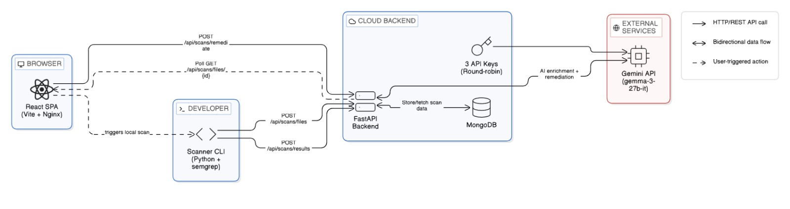
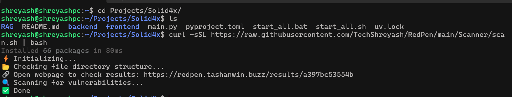
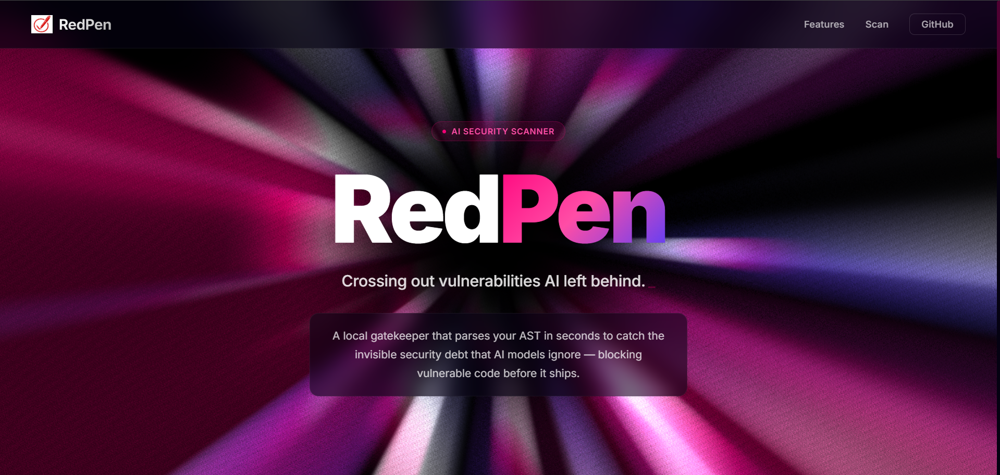
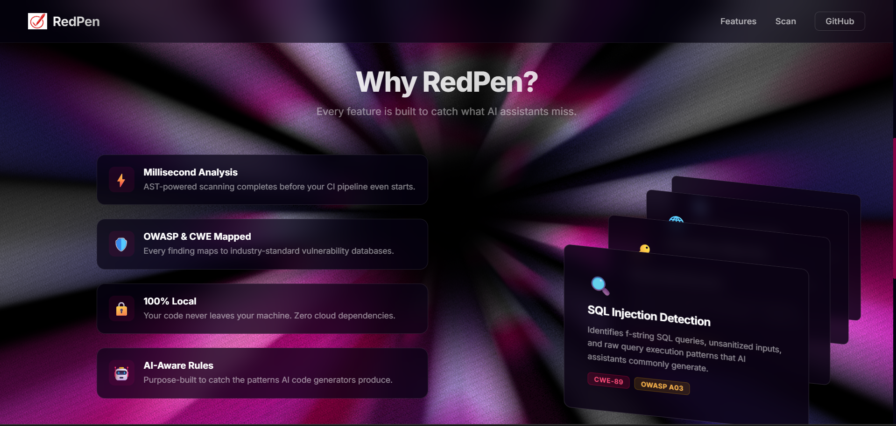

<p align="center">
  
</p>

<h1 align="center">RedPen</h1>

<p align="center">
  <strong>Crossing out vulnerabilities AI left behind.</strong>
</p>

<p align="center">
  <a href="https://redpen.tashanwin.buzz/results/a397bc53554b">🌐 Live Demo</a> &nbsp;•&nbsp;
  <a href="#-quick-start">⚡ Quick Start</a> &nbsp;•&nbsp;
  <a href="#-features">✨ Features</a> &nbsp;•&nbsp;
  <a href="#%EF%B8%8F-architecture--how-it-works">🏗️ Architecture</a> &nbsp;•&nbsp;
  <a href="#-local-development">🛠️ Development</a>
</p>

---

## 🔍 What is RedPen?

**RedPen** is a security vulnerability scanner purpose-built for the AI era. It performs deep AST-level analysis of your entire codebase using [Semgrep](https://github.com/semgrep/semgrep) to catch the invisible security debt that AI code generators (Copilot, Cursor, ChatGPT, etc.) routinely produce.

Findings are presented in a **rich, interactive web dashboard** where every vulnerability is pinpointed to its exact line of code — and with a single click, **Gemini AI generates a drop-in fix** that patches only the vulnerable snippet without breaking surrounding logic.

> **🔒 Privacy-first.** The scanner runs **100% locally** on your machine. Only the structured scan results (never your source code) are sent to the RedPen API.

### 🌐 Live Deployment

| Service | URL |
|---|---|
| **Demo Results**| [redpen.tashanwin.buzz/results/a397bc53554b](https://redpen.tashanwin.buzz/results/a397bc53554b) |
| **Dashboard** | [redpen.tashanwin.buzz](https://redpen.tashanwin.buzz/) |
| **API** | [redpen-api.tashanwin.buzz](https://redpen-api.tashanwin.buzz/) |

---

## ⚡ Quick Start

Navigate to **any** project directory and run a single command:

```bash
curl -sSL https://raw.githubusercontent.com/TechShreyash/RedPen/main/Scanner/scan.sh | bash
```


That's it. The script will:

1. 📦 Auto-install [`uv`](https://github.com/astral-sh/uv) if not present
2. 📂 Collect your project's file structure
3. 🔍 Run Semgrep AST analysis against your codebase
4. 📤 Upload structured results to the RedPen API
5. 🔗 Print a dashboard URL to view & fix your vulnerabilities

No setup, no dependencies to manage, no config files — works on any Linux / macOS machine out of the box.

---

## ✨ Features

### Core Capabilities

- **Comprehensive Code Analysis** — Analyzes the complete codebase of a project to identify hidden security vulnerabilities using Semgrep's AST-powered semantic analysis (not regex), resulting in near-zero false positives.
- **Vulnerability Visualization** — A React frontend visually highlights the vulnerable parts of the code, pinpointing the exact location the issue exists, and displays detailed vulnerability information.
- **AI Remediation & Summarization** — Integrated the Gemini API to automatically summarize vulnerabilities and generate code fixes, ensuring it updates only the specific vulnerable code snippet without breaking surrounding logic.
- **Automated Remediation** — Allows the user to understand the issue via summaries and retrieve the actual fixed code to patch the vulnerability seamlessly.
- **Execution & Accessibility** — Upgraded the tool from a standard CLI to be executable anywhere using a single `curl` bash command.
- **Data Persistence (Backend)** — Developed a backend using FastAPI and MongoDB to systematically store and manage vulnerability scan details.
- **Cloud Deployment** — Successfully deployed live versions of both the frontend and backend on a Vultr server.

### What It Detects

| Vulnerability | Example Pattern | Reference |
|---|---|---|
| **SQL Injection** | f-string queries, unsanitized inputs | CWE-89 |
| **Hardcoded Secrets** | JWT secrets, API keys in source | CWE-798 |
| **CORS Misconfiguration** | Wildcard origins, permissive headers | CWE-942 |
| **Auth Bypass** | Unverified JWT decodes, disabled signature checks | CWE-287 |
| **Broken Crypto** | MD5 hashing, weak algorithms | CWE-327 |
| **XSS** | Reflected untrusted input without sanitization | CWE-79 |

---

## 🏗️ Architecture & How It Works



### Step 1: Scan Initialization (CLI)

- Developer runs the scanner CLI against their project folder: `uv run Scanner/scanner.py <project-folder>`
- Scanner walks the directory tree and collects all file paths, excluding folders like `node_modules`, `.git`, `__pycache__`, etc.
- Scanner sends a `POST /api/scans/files` request to the backend with the file list.
- Backend generates a unique `scan_id` (12-character hex), stores the file structure in MongoDB (`file_structures` collection), and returns the `scan_id`.
- Scanner prints the results URL to the console: `https://redpen.tashanwin.buzz/<scan_id>`



### Step 2: AST Analysis & Title Enrichment

- Scanner runs Semgrep locally on the project folder using the auto ruleset: `semgrep scan --config auto --json --quiet <folder>`
- Semgrep returns raw JSON containing detected vulnerabilities with file path, line numbers, rule ID, severity, and message.
- Scanner post-processes results by extracting code snippets, expanding context lines, and cleaning metadata (CWE, OWASP tags).
- Scanner sends processed results via `POST /api/scans/results` to the backend along with the `scan_id`.
- Backend receives scan results and stores raw findings in MongoDB (`scan_results` collection).
- Backend asynchronously triggers `enrich_results_with_titles()` to process findings.
- All findings are sent to Google Gemini (gemma-3-27b-it) in a single batched prompt (using round-robin API key rotation to avoid limits).
- Gemini returns short, human-readable titles for each vulnerability, which are updated in MongoDB.

### Step 3: Interactive Dashboard

- Developer opens the results URL; React frontend loads at `/results/<scan_id>`.
- Frontend starts polling `GET /api/scans/files/<scan_id>` every 2 seconds.
- While the scan is in progress, a scanning progress bar with status messages is displayed.


- Once the backend returns status complete, polling stops and results are rendered:
  - **Left panel**: Project file tree with indicators on vulnerable files.
  - **Top bar**: Error/warning counts and scan duration.
  - **Right panel**: Code viewer (initially empty).




### Step 4: Vulnerability Visualization

- **When a file is selected**: Full source code is displayed with vulnerable lines highlighted.
- **When a vulnerability is selected**: Code viewer scrolls to the exact lines, displaying metadata such as severity, file, line range, CWE, and OWASP tags.


### Step 5: AI Remediation

- Developer clicks **“Fix with AI”** on a vulnerability.
- Frontend opens a remediation modal and sends `POST /api/scans/remediate` with full finding context.
- Backend constructs a prompt and sends it to Google Gemini for a fix suggestion.
- Gemini returns a JSON response containing:
  - `fixed_code`: Replacement code snippet
  - `explanation`: Brief description of changes
  - `security_note`: Note on remaining risks
- Backend computes a line-by-line diff between original and fixed code.
- Frontend displays the Explanation panel, Security note, Fixed code block with copy option, and Colored diff view (additions and removals).
- Developer copies the fixed code and applies it manually to their codebase.


---

## 📁 Project Structure

```
RedPen/
├── Scanner/                  # Local CLI scanner
│   ├── scanner.py            # Core engine: Semgrep + result processing
│   ├── scan.sh               # One-liner bash wrapper (auto-installs uv)
│   ├── pyproject.toml        # Python dependencies (inline script metadata)
│   └── cmds.txt              # Quick-reference commands
│
├── backend/                  # FastAPI REST API
│   ├── main.py               # API routes (files, results, remediate)
│   ├── database.py           # MongoDB connection (Motor async driver)
│   ├── gemini_summary.py     # AI title generation (multi-key load balancing)
│   ├── Dockerfile            # Production container (Python 3.12-slim)
│   └── pyproject.toml        # Python dependencies
│
├── frontend/                 # React + Vite SPA
│   ├── src/
│   │   ├── App.jsx           # Router (/, /results/:id, /scan/:id)
│   │   ├── api.js            # API service layer + polling logic
│   │   ├── pages/
│   │   │   ├── HomePage.*    # Landing page with animated background
│   │   │   ├── ResultsPage.* # Three-panel vulnerability dashboard
│   │   │   └── ScanResultsPage.* # Scan progress view
│   │   └── components/
│   │       ├── FileTree/     # Interactive project file navigator
│   │       ├── CodeViewer/   # Syntax-highlighted code with vuln markers
│   │       ├── RemediationModal/ # AI fix generation modal
│   │       ├── VulnerabilityCard.* # Expandable finding detail card
│   │       ├── StatsPanel.*  # Severity breakdown statistics
│   │       ├── ScanProgress/ # Animated scan status sequence
│   │       ├── PrismaticBurst/ # WebGL animated background
│   │       ├── ShapeGrid/    # Interactive grid background
│   │       ├── CardSwap/     # Auto-rotating feature cards
│   │       └── TextType/     # Typewriter text effect
│   ├── Dockerfile            # Multi-stage build (Node 22 → Nginx)
│   └── package.json
│
└── README.md
```

---

## 🛠️ Local Development

### Prerequisites

- **Python** ≥ 3.10 with [uv](https://github.com/astral-sh/uv)
- **Node.js** ≥ 18
- **MongoDB** (local instance or Atlas URI)
- **Gemini API Key(s)** — for AI titles & remediation

### Backend

```bash
cd backend

# Copy and configure environment variables
cp .env.example .env
# Edit .env with your MONGO_URL and GEMINI_API_KEY_1

# Install dependencies & run
uv sync
uv run uvicorn main:app --reload --port 8000
```

API available at `http://localhost:8000`

### Frontend

```bash
cd frontend

# (Optional) Override API URL for local backend
cp .env.example .env.local
# Uncomment VITE_API_BASE in .env.local

npm install
npm run dev
```

Dashboard available at `http://localhost:5173`

### Scanner

```bash
cd Scanner
uv run scanner.py
```

Or from any project directory via the one-liner:

```bash
curl -sSL https://raw.githubusercontent.com/TechShreyash/RedPen/main/Scanner/scan.sh | bash
```

---

## 🐳 Deployment

Both frontend and backend include production-ready Dockerfiles.

```bash
# Backend
cd backend
docker build -t redpen-api .
docker run -p 8000:8000 --env-file .env redpen-api

# Frontend
cd frontend
docker build -t redpen-web .
docker run -p 80:80 redpen-web
```

> **PaaS-ready:** Both Dockerfiles are optimized for one-click deployment on Coolify, Railway, Fly.io, or similar platforms.

### Environment Variables

| Variable | Required | Description |
|---|---|---|
| `MONGO_URL` | ✅ | MongoDB connection string |
| `MONGO_DB` | ❌ | Database name (default: `redpen`) |
| `GEMINI_API_KEY_1` | ✅ | Google Gemini API key for AI titles & remediation |
| `GEMINI_API_KEY_2` | ❌ | Additional key for round-robin load balancing |
| `GEMINI_API_KEY_3` | ❌ | Additional key for round-robin load balancing |
| `ALLOWED_ORIGINS` | ❌ | Comma-separated CORS origins (has sensible defaults) |

---

## 🔌 API Reference

| Method | Endpoint | Description |
|---|---|---|
| `POST` | `/api/scans/files` | Save file structure → returns `{ scan_id }` |
| `GET` | `/api/scans/files/:id` | Retrieve file structure for a scan |
| `POST` | `/api/scans/results` | Save scan results (triggers AI title enrichment) |
| `GET` | `/api/scans/results/:id` | Retrieve enriched scan results |
| `POST` | `/api/scans/remediate` | Generate AI-powered code fix for a finding |

---

## 🧰 Tech Stack

| Layer | Technology |
|---|---|
| **Scanner** | Python, Semgrep (AST analysis), uv |
| **Backend** | FastAPI, Uvicorn, Pydantic, Motor (async MongoDB) |
| **Database** | MongoDB |
| **AI** | Google Gemini API — Gemma 3 4B IT (titles) · Gemma 3 27B IT (fixes) |
| **Frontend** | React 19, Vite, React Router, Shiki (syntax highlighting) |
| **UI Effects** | GSAP, OGL (WebGL), CSS animations |
| **Deployment** | Docker (multi-stage), Nginx, Vultr |

---

## 📄 License

This project is licensed under the [MIT License](LICENSE).

---

<p align="center">
  <strong>Built for Hackathon 2026</strong> • RedPen Security
</p>
